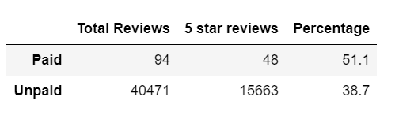

# Amazon_Vine_Analysis

## Overview

This project aims to analyse product reviews from Amazon as well as compare data from spontaneous reviews and those given as part of Vine program. According to Amazon [website](https://www.amazon.com/vine/about), Vine is an invitation-only program, in which top-reviewers recieve free products to create a number of reviews for new items. The analysis was made using Python, Spark, and Pandas, in addition to cloud tools such as Google Colab and AWS.

## Results

The category of product chosen for this analysis is Video Games, and results are detailed below:

- As can be seen in the previous dataframe, the total amount of reviews within the Vine program is 94, while non-Vine sums 40471.
- Taking only 5-star reviws into consideration, the total count for Vine reviews is 48 versus 15663 reviews out of the program.
- Resulting into 51.1% of 5 star reviews in the Vine program, and 38.7% for non-Vine.

## Summary

When analysing the percentages of 5-star reviews, it seems evident a positivity bias for Vine reviews. A difference between 51.1% for Vine and 38.7% for non-Vine reviews is significant. However, it is not enough to ensure those reviews were not trustworthy. In order to confirm this hypotesis, it would be interesting check the mean, median, and standard deviation of the reviews, even plot in a bar chart, with separate colors for paid and unpaid reviews. Also, it could be benefitial run the same analysis for other categories of product to test if the results are similar.